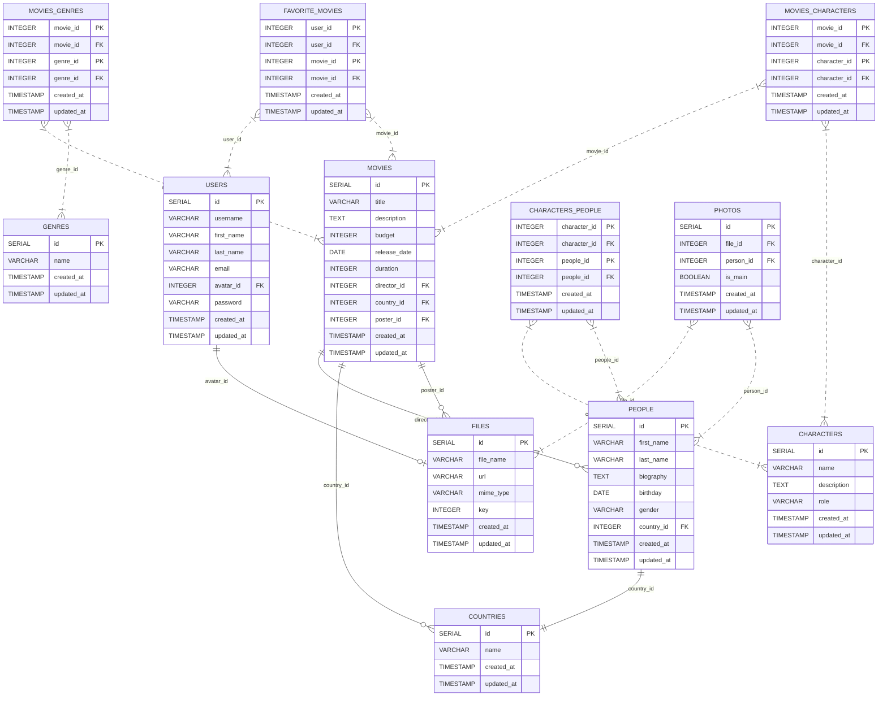

```mermaid
erDiagram
    FILES {
        SERIAL id PK
        VARCHAR file_name
        VARCHAR url
        VARCHAR mime_type
        INTEGER key
        TIMESTAMP created_at
        TIMESTAMP updated_at
    }
    USERS {
        SERIAL id PK
        VARCHAR username
        VARCHAR first_name
        VARCHAR last_name
        VARCHAR email
        INTEGER avatar_id FK
        VARCHAR password
        TIMESTAMP created_at
        TIMESTAMP updated_at
    }
    COUNTRIES {
        SERIAL id PK
        VARCHAR name
        TIMESTAMP created_at
        TIMESTAMP updated_at
    }
    PEOPLE {
        SERIAL id PK
        VARCHAR first_name
        VARCHAR last_name
        TEXT biography
        DATE birthday
        VARCHAR gender
        INTEGER country_id FK
        TIMESTAMP created_at
        TIMESTAMP updated_at
    }
    MOVIES {
        SERIAL id PK
        VARCHAR title
        TEXT description
        INTEGER budget
        DATE release_date
        INTEGER duration
        INTEGER director_id FK
        INTEGER country_id FK
        INTEGER poster_id FK
        TIMESTAMP created_at
        TIMESTAMP updated_at
    }
    GENRES {
        SERIAL id PK
        VARCHAR name
        TIMESTAMP created_at
        TIMESTAMP updated_at
    }
    MOVIES_GENRES {
        INTEGER movie_id PK
        INTEGER movie_id FK
        INTEGER genre_id PK
        INTEGER genre_id FK
        TIMESTAMP created_at
        TIMESTAMP updated_at
    }
    CHARACTERS {
        SERIAL id PK
        VARCHAR name
        TEXT description
        VARCHAR role
        TIMESTAMP created_at
        TIMESTAMP updated_at
    }
    MOVIES_CHARACTERS {
        INTEGER movie_id PK
        INTEGER movie_id FK
        INTEGER character_id PK
        INTEGER character_id FK
        TIMESTAMP created_at
        TIMESTAMP updated_at
    }
    CHARACTERS_PEOPLE {
        INTEGER character_id PK
        INTEGER character_id FK
        INTEGER people_id PK
        INTEGER people_id FK
        TIMESTAMP created_at
        TIMESTAMP updated_at
    }
    PHOTOS {
        SERIAL id PK
        INTEGER file_id FK
        INTEGER person_id FK
        BOOLEAN is_main
        TIMESTAMP created_at
        TIMESTAMP updated_at
    }
    FAVORITE_MOVIES {
        INTEGER user_id PK
        INTEGER user_id FK
        INTEGER movie_id PK
        INTEGER movie_id FK
        TIMESTAMP created_at
        TIMESTAMP updated_at
    }

    USERS ||--o| FILES : "avatar_id"
    PEOPLE ||--|| COUNTRIES : "country_id"
    MOVIES ||--o{ PEOPLE : "director_id"
    MOVIES ||--o{ COUNTRIES : "country_id"
    MOVIES ||--o{ FILES : "poster_id"
    MOVIES_GENRES }|..|{ MOVIES : "movie_id"
    MOVIES_GENRES }|..|{ GENRES : "genre_id"
    MOVIES_CHARACTERS }|..|{ MOVIES : "movie_id"
    MOVIES_CHARACTERS }|..|{ CHARACTERS : "character_id"
    CHARACTERS_PEOPLE }|..|{ CHARACTERS : "character_id"
    CHARACTERS_PEOPLE }|..|{ PEOPLE : "people_id"
    PHOTOS }|..|{ FILES : "file_id"
    PHOTOS }|..|{ PEOPLE : "person_id"
    FAVORITE_MOVIES }|..|{ USERS : "user_id"
    FAVORITE_MOVIES }|..|{ MOVIES : "movie_id"

```
